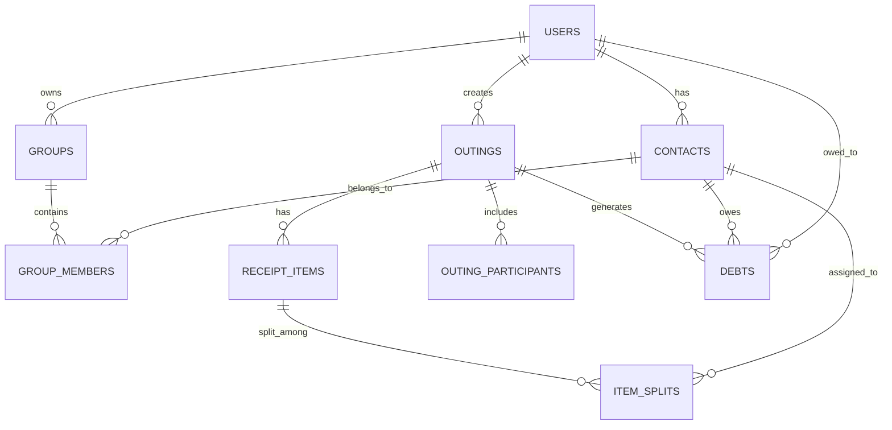

# Data Model: Smart Bill Splitting App

**Feature**: `001-bill-split-app`
**Date**: 2026-03-13
**Storage**: Supabase (PostgreSQL) with Row-Level Security

## Entity Relationship Diagram

## Entities

### Users

| Field | Type | Constraints | Description |
|-------|------|-------------|-------------|
| id | UUID | PK, default gen_random_uuid() | Supabase auth.users reference |
| full_name | TEXT | NOT NULL | Display name |
| phone_number | TEXT | NOT NULL, UNIQUE | E.164 format |
| avatar_url | TEXT | NULLABLE | Profile photo storage URL |
| fcm_token | TEXT | NULLABLE | Firebase Cloud Messaging token |
| phone_hash | TEXT | NOT NULL, UNIQUE, INDEX | SHA-256 hash for discovery |
| created_at | TIMESTAMPTZ | NOT NULL, default now() | Registration timestamp |
| updated_at | TIMESTAMPTZ | NOT NULL, default now() | Last update |

**RLS**: Users can only read/update their own row. Discovery queries use `phone_hash` column.

---

### Contacts

| Field | Type | Constraints | Description |
|-------|------|-------------|-------------|
| id | UUID | PK, default gen_random_uuid() | |
| user_id | UUID | FK → users.id, NOT NULL | Owner of this contact |
| friend_name | TEXT | NOT NULL | Contact display name |
| phone_number | TEXT | NULLABLE | Phone number (from contacts) |
| registered_user_id | UUID | FK → users.id, NULLABLE | If this contact is a registered user |
| avatar_url | TEXT | NULLABLE | Contact avatar |
| created_at | TIMESTAMPTZ | NOT NULL, default now() | |

**RLS**: Users can only CRUD contacts where `user_id = auth.uid()`.

**Validation**: `friend_name` must be 1-100 characters.

---

### Groups

| Field | Type | Constraints | Description |
|-------|------|-------------|-------------|
| id | UUID | PK, default gen_random_uuid() | |
| user_id | UUID | FK → users.id, NOT NULL | Group owner |
| group_name | TEXT | NOT NULL | Display name (e.g., "Work Crew") |
| created_at | TIMESTAMPTZ | NOT NULL, default now() | |

**RLS**: Users can only CRUD groups where `user_id = auth.uid()`.

**Validation**: `group_name` must be 1-50 characters, unique per user.

---

### Group Members

| Field | Type | Constraints | Description |
|-------|------|-------------|-------------|
| id | UUID | PK, default gen_random_uuid() | |
| group_id | UUID | FK → groups.id, NOT NULL, ON DELETE CASCADE | |
| contact_id | UUID | FK → contacts.id, NOT NULL, ON DELETE CASCADE | |

**Unique constraint**: (group_id, contact_id)

**RLS**: Users can only access entries where `group.user_id = auth.uid()`.

---

### Outings (Receipts)

| Field | Type | Constraints | Description |
|-------|------|-------------|-------------|
| id | UUID | PK, default gen_random_uuid() | |
| user_id | UUID | FK → users.id, NOT NULL | Bill owner / creator |
| place_name | TEXT | NULLABLE | Restaurant or venue name |
| total_amount | DECIMAL(12,2) | NOT NULL | Total bill amount |
| tax_amount | DECIMAL(12,2) | NOT NULL, default 0 | Tax component |
| service_amount | DECIMAL(12,2) | NOT NULL, default 0 | Service charge component |
| receipt_image_url | TEXT | NULLABLE | Stored receipt image path |
| status | TEXT | NOT NULL, default 'draft' | 'draft', 'completed', 'shared' |
| created_at | TIMESTAMPTZ | NOT NULL, default now() | |

**RLS**: Users can only CRUD outings where `user_id = auth.uid()`.

**Validation**: `total_amount >= 0`, `tax_amount >= 0`, `service_amount >= 0`.

**State transitions**: draft → completed (all items assigned) → shared (results sent).

---

### Outing Participants

| Field | Type | Constraints | Description |
|-------|------|-------------|-------------|
| id | UUID | PK, default gen_random_uuid() | |
| outing_id | UUID | FK → outings.id, NOT NULL, ON DELETE CASCADE | |
| contact_id | UUID | FK → contacts.id, NOT NULL | |
| total_owed | DECIMAL(12,2) | NOT NULL, default 0 | Calculated total for this person |

**Unique constraint**: (outing_id, contact_id)

---

### Receipt Items

| Field | Type | Constraints | Description |
|-------|------|-------------|-------------|
| id | UUID | PK, default gen_random_uuid() | |
| outing_id | UUID | FK → outings.id, NOT NULL, ON DELETE CASCADE | |
| item_name | TEXT | NOT NULL | Name from OCR/manual entry |
| price | DECIMAL(12,2) | NOT NULL | Item price |
| sort_order | INTEGER | NOT NULL, default 0 | Display order |

**RLS**: Users can only access items where `outing.user_id = auth.uid()`.

**Validation**: `item_name` 1-200 characters, `price >= 0`.

---

### Item Splits

| Field | Type | Constraints | Description |
|-------|------|-------------|-------------|
| id | UUID | PK, default gen_random_uuid() | |
| item_id | UUID | FK → receipt_items.id, NOT NULL, ON DELETE CASCADE | |
| contact_id | UUID | FK → contacts.id, NOT NULL | |
| split_percentage | DECIMAL(5,2) | NOT NULL, default 100.00 | % of item assigned |
| split_amount | DECIMAL(12,2) | NOT NULL | Calculated amount = price × percentage |

**Unique constraint**: (item_id, contact_id)

**Validation**: `split_percentage` between 0.01 and 100.00. Sum of percentages per item must equal 100%.

---

### Debts

| Field | Type | Constraints | Description |
|-------|------|-------------|-------------|
| id | UUID | PK, default gen_random_uuid() | |
| outing_id | UUID | FK → outings.id, NOT NULL, ON DELETE CASCADE | |
| debtor_contact_id | UUID | FK → contacts.id, NOT NULL | Person who owes |
| creditor_user_id | UUID | FK → users.id, NOT NULL | Person who is owed (bill owner) |
| amount | DECIMAL(12,2) | NOT NULL | Total amount owed |
| is_paid | BOOLEAN | NOT NULL, default false | Payment status |
| created_at | TIMESTAMPTZ | NOT NULL, default now() | |

**RLS**: Users can only access debts where `creditor_user_id = auth.uid()`.

---

## Indexes

| Table | Index | Columns | Purpose |
|-------|-------|---------|---------|
| users | idx_users_phone_hash | phone_hash | User discovery by phone |
| contacts | idx_contacts_user_id | user_id | User's contact list |
| outings | idx_outings_user_id_created | user_id, created_at DESC | History listing |
| receipt_items | idx_items_outing_id | outing_id | Items per outing |
| item_splits | idx_splits_item_id | item_id | Splits per item |
| debts | idx_debts_outing_id | outing_id | Debts per outing |
| debts | idx_debts_creditor | creditor_user_id, is_paid | Unpaid debts |

## Storage Buckets

| Bucket | Purpose | Access |
|--------|---------|--------|
| avatars | User profile photos | Public read, owner write |
| receipts | Receipt images | Owner read/write only |
